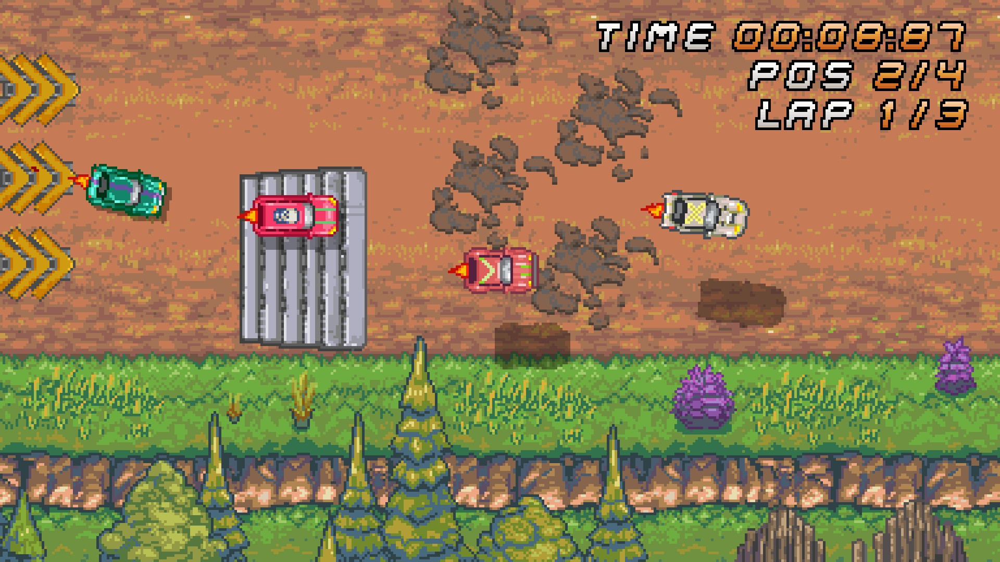
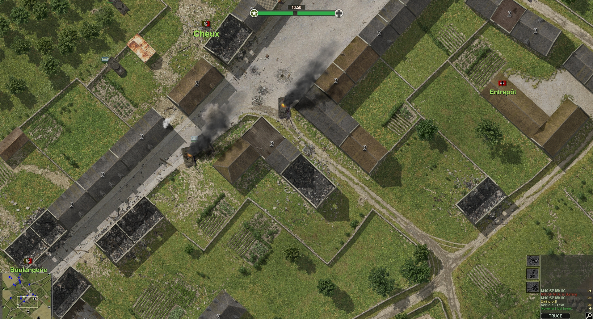
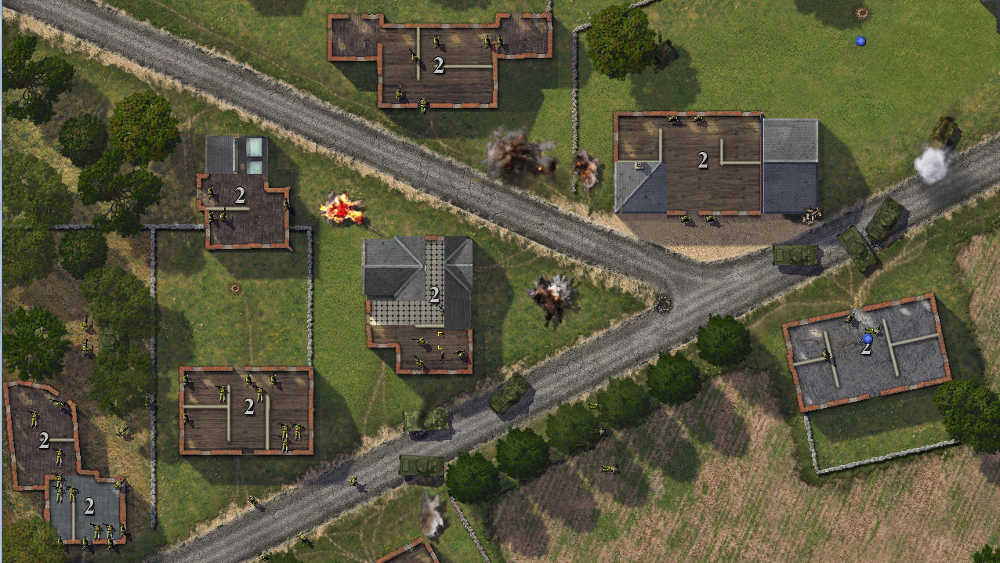
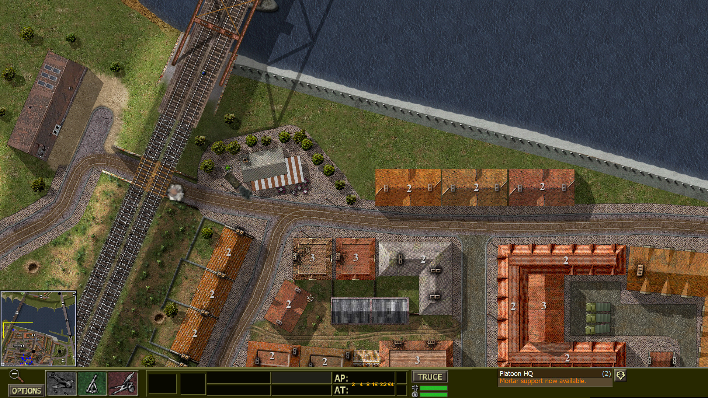
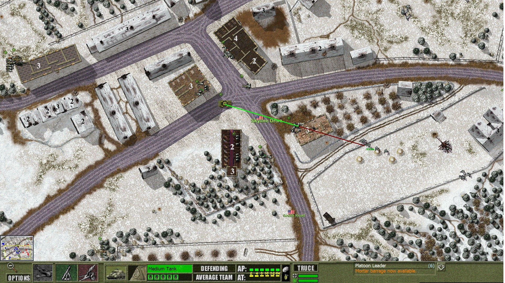
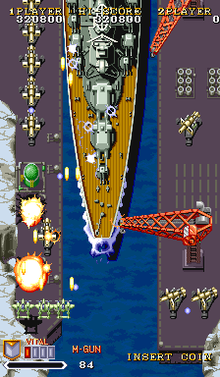

# Awesome-TrueTopDown
A curated list of awesome "true" top down games

---

SURV - https://store.steampowered.com/app/670620/

Noct - https://store.steampowered.com/app/330570/

Hotline Miami - https://store.steampowered.com/app/219150/

Hotline Miami 2 - https://store.steampowered.com/app/274170/

Super Arcade Racing - https://store.steampowered.com/app/1103770/

Over 9000 Zombies - https://store.steampowered.com/app/273500/

Close Combat Series (Except Some Games) - https://store.steampowered.com/bundle/14953/

Raiden Series - https://en.wikipedia.org/wiki/Raiden_(series)

1942 (1984) - https://en.wikipedia.org/wiki/1942_(video_game)

1941: Counter Attack (1990) - https://en.wikipedia.org/wiki/1941:_Counter_Attack

Galaga (1981) - https://en.wikipedia.org/wiki/Galaga

---
# Thanks
